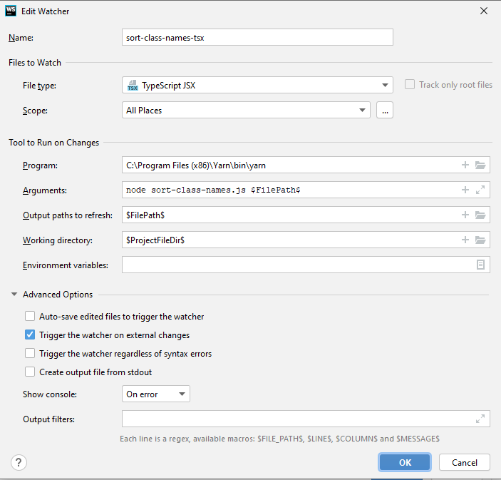

## initiales setup um sortierungsliste zu schreiben

## setup with intellij via filewatcher (webstorm, phpstorm, ...)

Neuen custom `File Watcher` erstellen via [Settings > Tools > File Watchers > `+` > custom](https://www.jetbrains.com/help/webstorm/using-file-watchers.html#ws_creating_file_watchers) und wie folgt einrichten:

1. `Program:` => path to yarn-binary (e.g. `C:\Program Files (x86)\Yarn\bin\yarn`)
2. `Arguments`: `node sort-class-names.js $FilePath$`
    - `node sort-class-names.js` (script from this repo - you need to copy it into your workspace)
    - (empty space to seperate the script from its argument)
    - `$FilePath$` which is the currently edited file
3. `Output paths to refres:` => `$FilePath$`
4. `Working Directory:` => `$ProjectFileDir$` (so that the node-script can use the node_modules folder correctly with the correct wrking dir)
5. (ausklappen von "Working directory and Environment Variables")
5. disable `Auto-save edited files to trigger the watcher`
6. (make sure to not use prettier on save on this files)